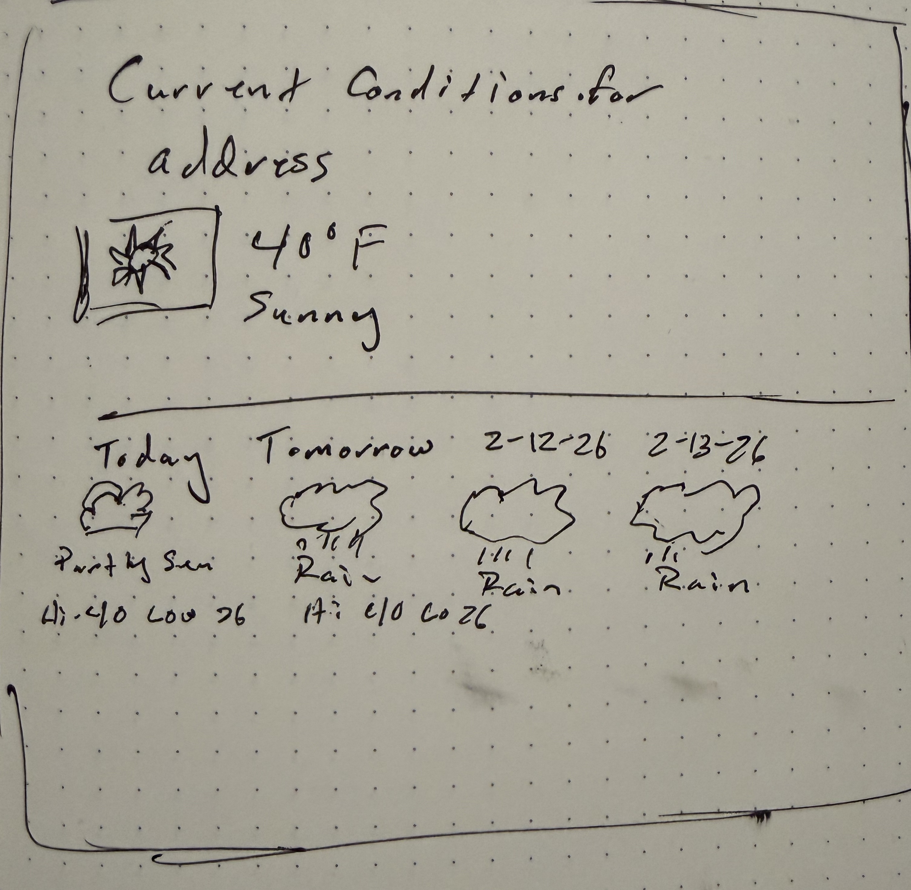
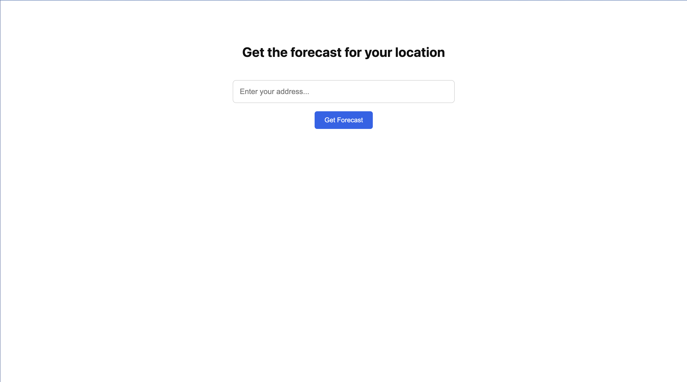

# README

## Infra

This project runs within Docker containers using Docker compose. There are two containers; app, and db. The following commands can be used with the containers:

### Building the Docker containers

`docker compose build`

### Running the Docker containers

`docker compose up` or use `docker compose up -d` to run in the background.

### Running tests

There are two methods for running tests. The first is a one-off container and the second one is connecting to the app container to run tests.

*One-off Container*

`docker compose run --rm app bin/rspec`

*Connect to app Instance*

`docker compose exec app bash`

Once connected then simply run `bin/rspec`.

### Notes

Why is there a db container if it's not used?

Although not currently used for persistence, the database container reflects a realistic production environment. In a real system, user queries and forecasts would likely be persisted for analytics, auditing, or rate limiting.

## Application

### Architecture Overview

The application is intentionally decomposed into small, focused components with clear responsibilities.

At a high level, the request flow is:

1. A user submits an address via the `ForecastsController#create` action.
2. The controller delegates to the `WeatherForecaster` service.
3. The `WeatherForecaster`:
    * Uses the geocoder to resolve the address into latitude, longitude, and postcode.
    * Checks the cache for an existing forecast keyed by postcode.
    * If cached, returns the cached result.
    * If not cached, calls the weather service and stores the normalized result in cache for 30 minutes.
4. The controller redirects to `ForecastsController#show`.
5. The `show` action renders the forecast using immutable value objects.

This separation ensures:

* Controllers handle HTTP concerns only.
* External APIs are isolated behind integration services.
* Orchestration logic lives in a coordinator service.
* View logic operates on normalized, immutable data structures.

This decomposition allows individual components to be tested in isolation and replaced independently if requirements evolve.

### Dependencies

Standard Ruby gems are used throughout with the exception of `http` for API requests and `rspec` for testing. The HTTP gem simplifies calling external endpoints, and RSpec is used as the testing framework.

### Services

The core of the application consists of a set of service objects each with their own individual responsibility. There are three core services; Nominatim which is our geocoding service, Open-Meteo which is our weather service and a weather forecaster coordinator service.

#### Nominatim API

This service is pretty straightforward. Takes an address (or location) and gives the postcode, latitude and longitude of said place if it can be found.

Since the data that we care about is so small, minimal schema validation is done.

Can be called by:

`Integrations::Geocoders::Nominatim.call(address: "800 Occidental Ave S, Seattle, WA 98134")`

Or by:

```ruby
geocoder = Integrations::Geocoders::Nominatim.new(address: "800 Occidental Ave S, Seattle, WA 98134")
geocoder.call
```

#### Open-Meteo API

This service is also pretty straightforward. Takes a latitude and longitude as inputs, validates the response and returns a normalized response that is easy to use. Since this schema is a little bit more involved then so is validating the JSON returned from the API.

Can be called by:

`Integrations::WeatherServices::OpenMeteo.call(latitude: "47.5952", longitude: "122.3316")`

Or by:

```ruby
weather_service = Integrations::WeatherServices::OpenMeteo.new(
    latitude: "47.5952", longitude: "122.3316")
weather_service.call
```

#### Weather Forecaster

This is a coordinator service that uses a geocoder and a weather service to generate a forecast result. It uses dependency injection with sane defaults for the geocoder, weather service, and the cache object. This allows geocoders or weather services to be swapped without modifying orchestration logic.

This service also caches data once retrieved using the postcode as part of the cache key.

Can be called by:

`WeatherForecaster.call(address: "800 Occidental Ave S, Seattle, WA 98134")`

Or by:

```ruby
forecaster = WeatherForecaster.new(address: "800 Occidental Ave S, Seattle, WA 98134")
forecaster.call
```

### Value Objects

The application models forecast data using immutable Value Objects implemented with Ruby’s Data.define. These objects encapsulate normalized API response data and provide a stable interface for the view layer.

This avoids passing raw API JSON directly to templates and improves reasoning, testability, and separation of concerns.

### Routes and Controller

There is one controller (forecasts controller) that is using RESTful semantics. There is a new endpoint, a show endpoint, and a create endpoint. We allow passing in a postcode parameter so that `forecasts/show/:postcode` can work.

This controller follows a Post-Redirect-Get pattern to prevent duplicate submissions and ensure refresh-safe behavior.

### Helpers

Helpers are used to convert WMO weather codes into human readable text as well as choosing the right weather icon for a given weather code.

### Tests

All tests are written in RSpec. External API calls are stubbed to ensure deterministic and fast test runs. Service objects are tested in isolation, and controller behavior is validated without making real HTTP requests.

Cache behavior and error handling paths are also covered to ensure predictable behavior under failure conditions.

### User Interface

#### Low Fidelity Mockups



#### Finished UI




#### Styling and Layout

The user interface uses plain CSS without external frameworks. Layout is driven by modern CSS features such as flexbox and grid.

The current conditions section uses a flex layout to emphasize the primary weather data, while the extended forecast uses a responsive grid to display seven days across a single row on larger screens. Media queries progressively collapse the grid on smaller viewports.

System fonts are used to avoid external dependencies and ensure native rendering across platforms. The design favors simplicity, readability, and minimal visual noise.

Weather icons are sourced from an open SVG set and mapped from WMO weather codes via view helpers.

### Scalability Considerations

Forecast responses are cached by postcode for 30 minutes to reduce external API usage and improve response times. In a production system, additional considerations would include rate limiting, background refresh strategies, persistence of request history, and monitoring of third-party API reliability.
